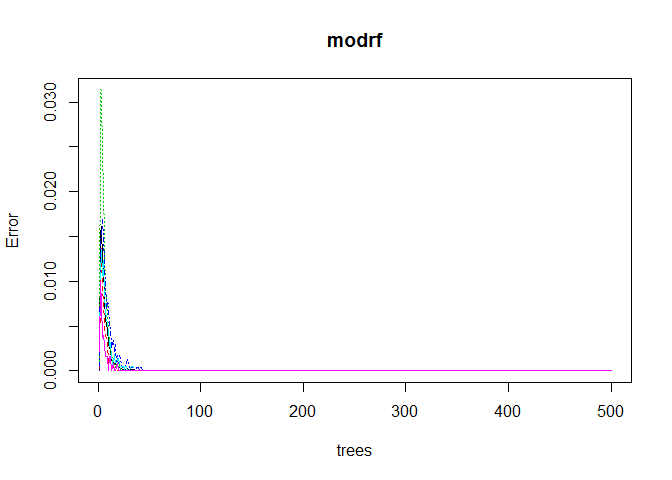
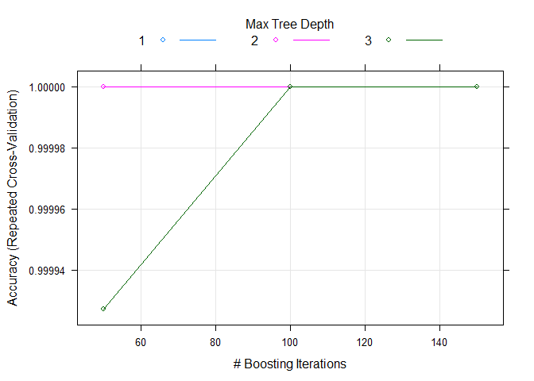

# Prediction Assignment
Sourav Tat  
October 11, 2017  


## Read the Training and Test data


```r
setwd("C:/Users/Sourav/Documents/Technical/Data Science/Coursera Data Science Specialization/Coursera_08_Practical Machine Learning/data")

#Download the data
if(!file.exists("pml-training.csv")){download.file("https://d396qusza40orc.cloudfront.net/predmachlearn/pml-training.csv", destfile = "pml-training.csv")}

if(!file.exists("pml-testing.csv")){download.file("https://d396qusza40orc.cloudfront.net/predmachlearn/pml-testing.csv", destfile = "pml-testing.csv")}


training <- read.csv("./pml-training.csv",header = T,na.strings=c("NA","#DIV/0!",""))
 test <- read.csv("./pml-testing.csv",header = T,na.strings=c("NA","#DIV/0!",""))
```

## Divide the supplied Training set into subtraining and subtest set.


```r
library(caret)
set.seed(1234)
idxtrain <- createDataPartition(training$classe,p=0.70,list=FALSE)
subtraining <- training[idxtrain,]
subtest <- training[-idxtrain,]
```


##  Check in case there is any missing values. If more than 60% of the values are missing for a column then omit that column for the model building.


```r
library(caret)
library(plyr)

# Check if the response is Null
sum(is.na(subtraining$classe))
```

```
## [1] 0
```

```r
# check for missing values in the entire set
dim(training[!complete.cases(subtraining),])[1]
```

```
## [1] 19622
```

```r
# Check columns in training set having more than 60% missing values
trainp_missing <- ldply(subtraining,function(x) mean(is.na(x)))
trainc_missing <- trainp_missing[trainp_missing$V1 > 0.60,]


#select the columns that do not match with the excluded columns 

colindx <- which(!(names(subtraining) %in% trainc_missing$.id))
subtraining_new <- subtraining[,colindx]

# Check if any NA value is present in the cleaned training/test set
sum(is.na(subtraining_new))
```

```
## [1] 0
```

```r
all(colSums(is.na(subtraining_new)) ==0)
```

```
## [1] TRUE
```


## Removing zero covariates


```r
nsv <- nearZeroVar(subtraining_new,saveMetrics = TRUE)
subtraining_new <- subtraining_new[,nsv$nzv==FALSE]
```

##Identify the skewed columns if any in the dataset

```r
library(moments)
#FInd the numeric Indexes
colnumindx <- which(lapply(subtraining_new,class) %in% c("numeric","integer"))
subtraining_skew_check <- subtraining_new[,colnumindx]
skewval <- skewness(subtraining_skew_check)


# % of columns having skewness
(sum(skewval < -1) + sum(skewval >1 )) / ncol(subtraining_new)
```

```
## [1] 0.2033898
```

```r
colskew1 <- which(skewval < -1)
colskew2 <- which(skewval > 1)
# Skewed columns in the dataset
colskew <- c(colskew1,colskew2)
```

## Preprocess the skewed data columns in subtraining data set. 

```r
subtraining_skew <- subtraining_new[,colskew]
preobj <- preProcess(subtraining_skew,method=c('center','scale'))
pre_training <- predict(preobj,subtraining_skew)
```

## Merge the non-skewed columns to the main subtraining dataset


```r
subtraining_nonskew <- subtraining_new[,setdiff(names(subtraining_new),names(subtraining_skew))]

subtraining <- cbind(pre_training,subtraining_nonskew)
```

## Apply the preprocess to transform the subtest and supplied test set


```r
subtest_skew <- subtest[,names(subtraining_skew)]
test_skew <- test[,names(subtraining_skew)]

# Apply the preprocessing to the sub test set and actual test set

subtest_skew <- predict(preobj,subtest_skew)
test_skew <- predict(preobj,test_skew)

subtest_nonskew <- subtest[,names(subtraining_nonskew)]
test_nonskew <- test[,names(subtraining_nonskew[,-47])]

# Merge the skew and non-skewed data for preprocessed subtest and test data set
subtest <- cbind(subtest_skew,subtest_nonskew)
test <- cbind(test_skew,test_nonskew)
```

# Prediction Model Selection

## Create a data model using Random Forest


```r
library(randomForest)
set.seed(12345)
modrf <- randomForest(classe~.,data=subtraining)
#modrf <- train(classe~.,data = subtraining,method="rf")
plot(modrf)
```

<!-- -->

```r
predrf <- predict(modrf,subtest,type="class")

cmrf <- confusionMatrix(predrf,subtest$classe)
cmrf$overall[1]
```

```
## Accuracy 
##        1
```

## Create a data model with boosting


```r
library(gbm)
set.seed(12345)


#modbst <- gbm(classe ~.,data=subtraining,distribution = "multinomial",n.trees = 500)


trcontrol <- trainControl(method = "repeatedcv",
                           number = 5,
                           repeats = 1)
modbst <- train(classe ~ ., data=subtraining, method = "gbm",
                 trControl = trcontrol,
                 verbose = FALSE)

plot(modbst)
```

<!-- -->

```r
predbst <- predict(modbst,subtest)

cmbst <- confusionMatrix(predbst,subtest$classe)
 cmbst$overall[1]
```

```
## Accuracy 
##        1
```


As both RandomForest and Boosting seems to be pretty accurate, we can chose any one of these for our final model building.Using RandomForest to given test sets containing 20 observations. We had to merge the data before using the model because RandomForest other throws error.

## Apply RandomForest to predict the Test Set


```r
# Defaulting the target outcome as 'B'
test$classe <- as.factor('B')

combine <- rbind(subtraining,test)
idxtrain <- 1:nrow(subtraining)
xtrain <- combine[idxtrain,]
xtest  <- combine[-idxtrain,]
set.seed(12345)

modrf1 <- randomForest(classe~.,data=xtrain,importance=TRUE,ntree=500)
predtest <- predict(modrf1,xtest,type="class")

predtest
```

```
##   1  21  36  46  54  67  71  87  94 105 113 121 132 141 151 168 171 183 
##   A   A   A   A   A   A   A   A   A   A   A   A   B   A   A   A   A   A 
## 191 203 
##   A   B 
## Levels: A B C D E
```
